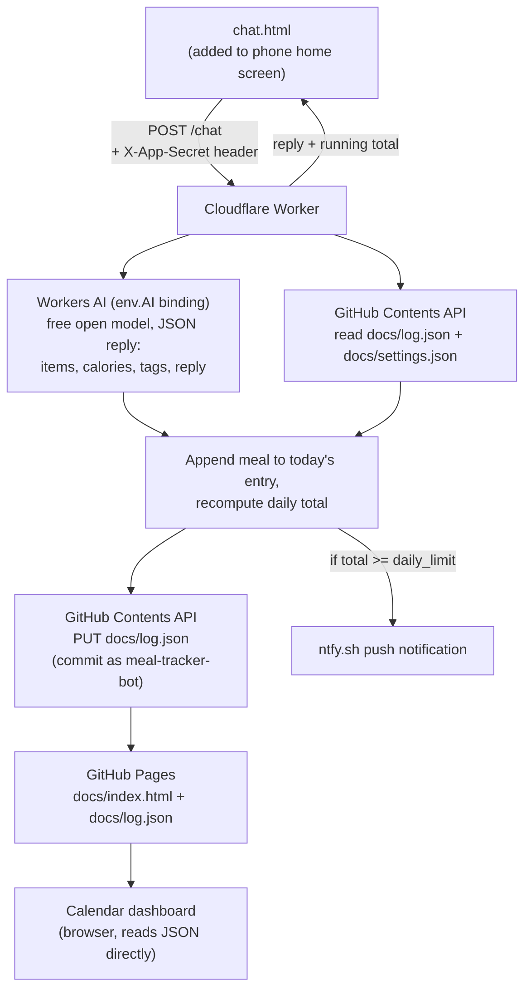

# Architecture

How this system is built and why. For setup and day-to-day changes, see
[INSTRUCTIONS.md](INSTRUCTIONS.md) instead.

## Design constraint: genuinely $0, mostly GitHub

Like the job-scraper project, the data store and dashboard are GitHub itself:
a git-committed JSON file is the database, and GitHub Pages (serving `docs/`)
is the read-only dashboard. The one addition here is a single Cloudflare
Worker, needed because — unlike the job-scraper's scheduled cron job — this
app has to respond to you in real time when you log a meal. GitHub Actions
has no "respond to an HTTP request in under a second" mode; Cloudflare
Workers' free tier (100k requests/day, no card required) does.

Calorie parsing runs on **Cloudflare Workers AI** (an open-source model, bound
directly into the Worker), not the Anthropic API — Anthropic has no free API
tier, and per-request billing would violate the "$0" requirement. Workers AI's
free daily allowance requires no card and, on Cloudflare's free Workers plan,
requests past that allowance simply fail rather than billing you — there's no
way to accidentally incur a charge. The trade-off is estimate quality: an open
8B model's calorie guesses are a real notch below Claude's, closer to "rough
ballpark" than "look this up carefully." See "Calorie estimation" below for
the actual prompt.

The Worker is the only thing that ever holds secrets (a GitHub token, your
ntfy topic, your app password). Nothing secret ever touches `docs/`, because
anything in `docs/` is public — view-source on the GitHub Pages site shows
everyone the code, same as job-scraper's dashboard.

## End-to-end flow



`index.html` (the calendar) and `chat.html` (the logging UI) both read
`log.json`/`settings.json` directly as static files — no Worker call needed
just to display data. The Worker is only invoked to *write* (`/chat`,
`/settings`).

## Repo layout

```
meal-tracker/
  docs/                    # GitHub Pages root — the only publicly served folder
    index.html             # calendar dashboard
    chat.html              # meal-logging chat UI (this is what you pin to your home screen)
    manifest.json           # lets chat.html be "installed" as a standalone app
    icon.svg
    log.json                # the meal log — written by the Worker, read by both pages
    settings.json            # { daily_limit } — written by the Worker's /settings endpoint
  worker/
    worker.js                # Cloudflare Worker source — paste into the dashboard's code editor
  ARCHITECTURE.md            # this file
  INSTRUCTIONS.md            # setup + day-to-day operations
```

There's no `data/` vs `docs/` split like job-scraper has — job-scraper keeps
a full permanent archive (`data/seen_jobs.json`) separate from a filtered
live view (`docs/jobs.json`) because those have different lifecycles
(archive never shrinks, live view expires closed jobs). Here, the log *is*
the display; there's nothing to filter out, so one file serves both purposes.

## Why the Worker needs `APP_SECRET`

CORS (`Access-Control-Allow-Origin`) only stops *browsers* from letting other
websites' JavaScript call your Worker — it does nothing against someone
calling the Worker URL directly (curl, a script, etc.), and the URL itself is
sitting in plain view in `chat.html`'s source once the repo is public. Without
a check, anyone who found that URL could rack up charges against your
Anthropic key or write garbage into your log. `APP_SECRET` is a password only
you know; the front end asks for it once, stores it in `localStorage`, and
sends it as `X-App-Secret` on every write. This is not bulletproof (anyone who
gets your phone unlocked and opens dev tools could read it out of
localStorage) but it stops the realistic threat, which is a stranger finding
the public URL.

## Data model

`docs/log.json`:

```json
{
  "2026-08-28": {
    "meals": [
      {
        "time": "2026-08-28T08:15:00.000Z",
        "raw_input": "2 eggs, 1 slice toast with butter, tags: breakfast vegetarian",
        "items": [
          { "name": "egg", "quantity": "2", "calories": 140 },
          { "name": "toast with butter", "quantity": "1 slice", "calories": 120 }
        ],
        "tags": ["breakfast", "vegetarian"],
        "total_calories": 260
      }
    ],
    "total_calories": 260
  }
}
```

`docs/settings.json`: `{ "daily_limit": 2000 }`.

## Calorie estimation

The Worker calls Workers AI's **JSON Mode** (`response_format: { type:
"json_schema", json_schema: MEAL_JSON_SCHEMA }`) rather than hoping a text
instruction is obeyed — this is enforced server-side by Cloudflare, though it
still isn't a 100% guarantee, so `extractMealJson()` falls back to
regex-extracting a `{...}` block if `result.response` ever comes back as a
string instead of the already-parsed object, and throws a friendly error
(rather than silently logging garbage) if neither works.

Two models are in play, both swappable via the `AI_MODEL`/`VISION_MODEL`
constants in `worker.js` if either is ever retired (check the Workers AI
models catalog):

- **Text** (`@cf/meta/llama-3.3-70b-instruct-fp8-fast`) — used for typed
  ingredient descriptions. The system prompt (`CALORIE_SYSTEM_PROMPT`)
  explicitly covers fraction/portion math (e.g. "1/3 of 200g blueberries")
  so a fraction applies only to the item it's stated against, not the whole
  message.
- **Vision** (`@cf/meta/llama-3.2-11b-vision-instruct`) — used when a photo
  is attached. `chat.html` downsizes the image client-side (longest edge
  1024px, JPEG quality 0.7) before sending, both to keep uploads fast on
  mobile data and to stay well under request size limits. The prompt
  (`PHOTO_SYSTEM_PROMPT`) distinguishes two cases: a **nutrition label**
  (read the printed calories-per-serving directly — reliable, it's an OCR
  task) versus a **menu photo** (find the dish named in the caption, use its
  listed calorie count if the menu shows one, otherwise estimate from its
  listed ingredients same as the text flow). A photo of an actual plated
  meal (as opposed to a menu or label) was deliberately not the target case
  here — estimating a real dish's calories purely from how it looks, with no
  visible portion weight or hidden ingredients like oil and sauce, would be
  considerably less reliable than either of the above.

Either path, estimates ultimately come from the model's general knowledge —
it has no internet access and no built-in nutrition database, so left alone
it's recalling patterns from training data, not looking anything up. That's
what "USDA grounding" (below) exists to fix for the text flow.

## USDA grounding (optional, improves accuracy)

If `USDA_API_KEY` is set (free key from USDA's FoodData Central), `callWorkersAI()`
runs a second pass: after the model's first attempt at parsing a text
message into items, each item's `name` is looked up via `lookupUsdaFood()`,
checking datasets in order — **Foundation** (USDA's newer, cleaner
plain-ingredient set) first, then **SR Legacy** (a much larger, older set
that also mixes in plenty of processed/prepared foods, so a noisier second
choice), then the full catalog including Branded products as a last resort.

`isPlausibleMatch()` rejects any candidate whose description is missing a
word from the query, rather than trying to maintain a list of "bad" words to
watch for — that's what catches a branded "MCDONALD'S, Hamburger" for a
"hamburger bun" query (missing "bun") or an "egg white" for a plain "egg"
query (an anticipated bad word would only ever catch mismatches seen before;
missing-word-checking catches whatever mismatch actually turns up).
`pickBestFood()` deliberately has no "close enough" fallback — if nothing
across all three dataset stages passes both the word-overlap and calorie
plausibility checks, that item just isn't grounded and falls back to the
model's own estimate, since a mismatched food presented as an authoritative
USDA fact is worse than an ungrounded estimate labeled as such. This is
still fundamentally best-effort text search, not a guaranteed-correct
lookup — the visible USDA link and matched food name in the reply exist
specifically so a future bad match is something the reader can catch by
eye, not something hidden behind a confident-looking number.

When multiple plausible matches would give meaningfully different answers
(kcal/100g differing by more than 15%), `lookupUsdaFood()` keeps up to three
as `alternatives` alongside the chosen best match, rather than silently
picking one. `callWorkersAI()` recomputes each alternative's calories using
the exact same gram basis as the chosen match, so switching is a straight
swap. `handleChat()` returns the new meal's `date`/`meal_index` specifically
so the front end can call `/edit-meal` again later to apply a chosen
alternative without needing a fresh model call — the arithmetic was already
done, only the item's stored fields change. Both `chat.html` (a picker
rendered under the item breakdown) and `index.html` (a picker under each
logged item) implement this the same way: mutate a local copy of that
meal's `items`, POST the whole array to `/edit-meal`, then reflect the
result.

**The actual calorie arithmetic happens in code, not inside the model.**
Earlier versions asked the model to convert "kcal per 100g" to the real
quantity itself, which proved unreliable — it would treat "100g" as if it
were one whole unit regardless of the food's real size, e.g. computing "5
eggs" as `5 × (kcal per 100g)` instead of scaling by an actual egg's ~50g
weight, overestimating by roughly 2x. Instead, each item's schema includes
`estimated_gram_weight` — the model's best real-world guess at how much the
*stated quantity* actually weighs (something models are reasonably good at;
arithmetic under structured-output constraints is what they're bad at). The
post-processing step in `callWorkersAI()` then computes
`calories = kcalPer100g × estimated_gram_weight ÷ 100` directly, and derives
`unit_calories` by dividing that total by a count parsed from `quantity` when
one exists. An explicit gram quantity in the message itself (e.g. "300g")
is trusted over the model's estimate, since there's nothing to estimate in
that case. The meal's `total_calories` is recomputed as the sum of all items
afterward, so it always stays consistent with whatever got overridden.

This is a pure accuracy improvement layered on top of the existing flow,
never a dependency: `USDA_API_KEY` unset, a lookup finding no match, or the
grounded second pass erroring all fall back cleanly to the original
model-only estimate (`callWorkersAI()`'s `firstPass`). The same lookup is
also used in `handleEstimateItem()` (the edit UI's per-item recalculate
button), just as a single fact folded into one model call rather than a
two-pass round trip, since there's no separate "first pass" needed there —
the typed description already tells us what to look up.

Deliberately not extended to the photo/vision path: a nutrition label
already gives an exact printed number (no lookup needed), and grounding menu
photo estimates would need matching a USDA generic food to whatever the menu's
own ingredient list says, which is a fuzzier problem than matching a plain
typed food name — left as model-only estimation for now.

## Editing and deleting meals

`/edit-meal` and `/delete-meal` (both in `worker.js`) address a meal by
`{date, index}` — its position in that day's `meals` array — rather than a
stored ID, since edits are simple read-modify-write cycles against the whole
`log.json` file and there's only ever one user acting on it at a time. Both
recompute that day's `total_calories` from scratch after the change. The
calendar dashboard's edit form re-renders items as plain `name | quantity |
calories` lines rather than a dynamic multi-field UI — less polished, but
far less code, and fine for how rarely this gets used.

`index.html`'s day-detail view also has an "Add a meal to this day" box,
which is really just the same `/chat` endpoint called with that day's date
instead of today's — useful for backfilling a forgotten meal on a past date.
All three of these update the in-memory `log` object directly from the
Worker's response rather than re-fetching `docs/log.json`, since GitHub
Pages' CDN can lag a few seconds to minutes behind a fresh commit.

## Known limitations (MVP)

- **Timezone**: `chat.html` sends the browser's local date so meals land on
  the day you actually ate them regardless of the Worker's server timezone.
  Logging right at midnight is the one edge case that could land on either
  day depending on exact timing.
- **Samsung calendar sync**: deliberately deferred. The planned path is
  generating an `.ics` feed from `log.json` and hosting it in `docs/`, then
  subscribing to it in Google Calendar ("Add calendar > From URL") — Samsung
  Calendar syncs Google calendars automatically, so no native Android code
  should be needed. Not built yet.
- **One Worker, one user**: there's no multi-user auth beyond the single
  shared `APP_SECRET` — fine for a personal app, not something to extend to
  multiple people without real auth.
