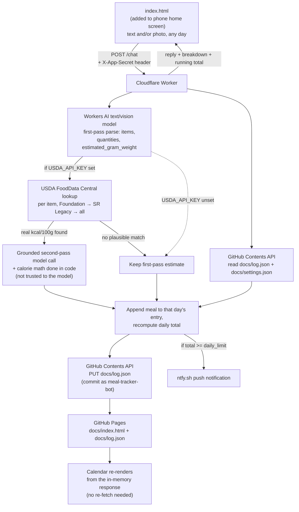

# Architecture

How this system is built and why. For setup and day-to-day changes, see
[INSTRUCTIONS.md](INSTRUCTIONS.md) instead.

## Design constraint: genuinely $0, mostly GitHub

Like the job-scraper project, the data store and dashboard are GitHub itself:
a git-committed JSON file is the database, and GitHub Pages (serving `docs/`)
is the read-only dashboard. The one addition here is a single Cloudflare
Worker, needed because — unlike the job-scraper's scheduled cron job — this
app has to respond to you in real time when you log a meal. GitHub Actions
has no "respond to an HTTP request in under a second" mode; Cloudflare
Workers' free tier (100k requests/day, no card required) does.

Calorie parsing runs on **Cloudflare Workers AI** (open-source models, bound
directly into the Worker), not the Anthropic API — Anthropic has no free API
tier, and per-request billing would violate the "$0" requirement. Workers AI's
free daily allowance requires no card and, on Cloudflare's free Workers plan,
requests past that allowance simply fail rather than billing you — there's no
way to accidentally incur a charge. The trade-off is estimate quality: an open
model's calorie guesses are a real notch below Claude's, closer to "rough
ballpark" than "look this up carefully" — USDA grounding (below) exists
specifically to close that gap for real ingredients. See "Calorie estimation"
below for the actual prompts.

The Worker is the only thing that ever holds secrets (a GitHub token, your
ntfy topic, your app password). Nothing secret ever touches `docs/`, because
anything in `docs/` is public — view-source on the GitHub Pages site shows
everyone the code, same as job-scraper's dashboard.

## End-to-end flow



`index.html` reads `log.json`/`settings.json` directly as static files on
load — no Worker call needed just to display data. The Worker is only
invoked to *write* (`/chat`, `/settings`, `/edit-meal`, `/delete-meal`,
`/estimate-item`).

## Worker endpoints

All five live in `worker.js`'s `ROUTES` map, POST-only, all requiring the
`X-App-Secret` header:

| Route | Does |
|---|---|
| `/chat` | Parses a text message and/or photo into a meal, logs it, returns the breakdown. The main entry point — also what "add a meal to this day" and backfilling a past date reuse, just with a different `localDate`. |
| `/settings` | Updates `daily_limit`. |
| `/edit-meal` | Overwrites one meal's `items`/`tags` by `{date, index}`, recomputing totals. Also how picking a USDA alternative gets persisted (see below). |
| `/delete-meal` | Removes one meal by `{date, index}`, recomputing totals. |
| `/estimate-item` | Recalculates a single item from a free-text description (the edit UI's ↻ button) — one model call, no logging side effects. |

## Repo layout

```
meal-tracker/
  docs/                    # GitHub Pages root — the only publicly served folder
    index.html             # the whole app: calendar + logging + editing (pin this to your home screen)
    manifest.json           # lets index.html be "installed" as a standalone app
    icon.svg
    log.json                # the meal log — written by the Worker, read on load
    settings.json            # { daily_limit } — written by the Worker's /settings endpoint
  worker/
    worker.js                # Cloudflare Worker source — paste into the dashboard's code editor
  ARCHITECTURE.md            # this file
  INSTRUCTIONS.md            # setup + day-to-day operations
```

There's no `data/` vs `docs/` split like job-scraper has — job-scraper keeps
a full permanent archive (`data/seen_jobs.json`) separate from a filtered
live view (`docs/jobs.json`) because those have different lifecycles
(archive never shrinks, live view expires closed jobs). Here, the log *is*
the display; there's nothing to filter out, so one file serves both purposes.

There used to also be a separate `chat.html` — a standalone chat-style
logging page, originally the thing pinned to the home screen while
`index.html` was just the read-only calendar. It was removed once every
logging feature (photo capture, meal/diet-type buttons, tags, the USDA
review picker) existed on the calendar's own "add a meal" box too, making
the second page pure duplication. The header's **+ Log a meal** button now
just selects today's date and scrolls/focuses that same box rather than
navigating anywhere — see "Calendar dashboard" below.

## Why the Worker needs `APP_SECRET`

CORS (`Access-Control-Allow-Origin`) only stops *browsers* from letting other
websites' JavaScript call your Worker — it does nothing against someone
calling the Worker URL directly (curl, a script, etc.), and the URL itself is
sitting in plain view in `index.html`'s source once the repo is public. Without
a check, anyone who found that URL could write garbage into your log or (if
`USDA_API_KEY` is set) burn through its request quota. `APP_SECRET` is a
password only you know; the front end asks for it once via a real password
input (autocapitalize/autocorrect/spellcheck all explicitly disabled — a
plain `prompt()` was tried first and mobile keyboard auto-capitalization
silently corrupted what got typed, causing "wrong password" failures that
had nothing to do with the actual password), stores it in `localStorage`,
and sends it as `X-App-Secret` on every write. This is not bulletproof
(anyone who gets your phone unlocked and opens dev tools could read it out
of localStorage) but it stops the realistic threat, which is a stranger
finding the public URL.

## Data model

`docs/log.json`:

```json
{
  "2026-08-28": {
    "meals": [
      {
        "time": "2026-08-28T08:15:00.000Z",
        "raw_input": "5 eggs",
        "from_photo": false,
        "items": [
          {
            "name": "egg",
            "quantity": "5",
            "calories": 370,
            "unit_label": "egg",
            "unit_calories": 74,
            "estimated_gram_weight": 250,
            "usda_source": true,
            "usda_reviewed": false,
            "usda_food": "Egg, whole, raw, fresh",
            "usda_kcal_per_100g": 148,
            "usda_url": "https://fdc.nal.usda.gov/food-details/.../nutrients",
            "usda_alternatives": []
          }
        ],
        "tags": ["breakfast", "vegetarian"],
        "total_calories": 370
      }
    ],
    "total_calories": 370
  }
}
```

Everything from `unit_label` onward is optional/best-effort per item —
`usda_*` fields only appear when grounding found and used a match (see "USDA
grounding" below); `usda_alternatives` only has entries when other plausible
matches existed with a meaningfully different calorie value. Older entries
logged before a given field existed simply don't have it, and every renderer
treats these fields as optional rather than assuming their presence.

`docs/settings.json`: `{ "daily_limit": 2000 }`.

## Design principle: the model estimates, code computes

This shows up in three separate places below (unit conversion, USDA volume
handling, and implicitly in how grounding is applied), so it's worth
stating once as a rule rather than three times as a bug story: **ask the
model for facts and judgment calls it's actually good at — a plausible
real-world weight, a food's identity, whether a value was explicitly
stated — and do every downstream arithmetic step in plain code, never
inside the model's own structured output.** Every time this project asked
the model to *combine* two numbers itself (converting "kcal per 100g" to a
real quantity, scaling a total across a count), it got it wrong in a
specific, repeatable way — not randomly, but systematically (treating "100g"
as if it were one whole unit regardless of the food's real size). Asking it
for one estimate at a time and doing the multiplication in `worker.js`
instead has held up so far. Keep this in mind before adding any new feature
that needs the model to produce more than one number that has to agree with
another.

## Calorie estimation

The Worker calls Workers AI's **JSON Mode** (`response_format: { type:
"json_schema", json_schema: MEAL_JSON_SCHEMA }`) rather than hoping a text
instruction is obeyed — this is enforced server-side by Cloudflare, though it
still isn't a 100% guarantee, so `extractMealJson()` falls back to
regex-extracting a `{...}` block if `result.response` ever comes back as a
string instead of the already-parsed object, and throws a friendly error
(rather than silently logging garbage) if neither works.

Two models are in play, both swappable via the `AI_MODEL`/`VISION_MODEL`
constants in `worker.js` if either is ever retired (check the Workers AI
models catalog):

- **Text** (`@cf/meta/llama-3.3-70b-instruct-fp8-fast`) — used for typed
  ingredient descriptions. The system prompt (`CALORIE_SYSTEM_PROMPT`)
  explicitly covers fraction/portion math (e.g. "1/3 of 200g blueberries")
  so a fraction applies only to the item it's stated against, not the whole
  message.
- **Vision** (`@cf/meta/llama-3.2-11b-vision-instruct`) — used when a photo
  is attached. `index.html` downsizes the image client-side (longest edge
  1024px, JPEG quality 0.7) before sending, both to keep uploads fast on
  mobile data and to stay well under request size limits. The prompt
  (`PHOTO_SYSTEM_PROMPT`) distinguishes two cases: a **nutrition label**
  (read the printed calories-per-serving directly — reliable, it's an OCR
  task) versus a **menu photo** (find the dish named in the caption, use its
  listed calorie count if the menu shows one, otherwise estimate from its
  listed ingredients same as the text flow). A photo of an actual plated
  meal (as opposed to a menu or label) was deliberately not the target case
  here — estimating a real dish's calories purely from how it looks, with no
  visible portion weight or hidden ingredients like oil and sauce, would be
  considerably less reliable than either of the above.

Either path, estimates ultimately come from the model's general knowledge —
it has no internet access and no built-in nutrition database, so left alone
it's recalling patterns from training data, not looking anything up. That's
what "USDA grounding" (below) exists to fix for the text flow.

The system prompts explicitly tell the model to consolidate a repeated food
into one item with a count in `quantity`, not list it as separate identical
entries ("5 eggs" is one item, not five "egg" entries) — but a "fast" free
model doesn't always comply, so `extractMealJson()` also merges any
duplicate item names into one combined entry (summing calories) as a
code-level safety net regardless of whether the model followed instructions.

Both model calls (`runCalorieModel()`, `callWorkersAIVision()`) set an
explicit `max_tokens: 3000` — the item schema is seven fields deep now
(`name`, `quantity`, `calories`, `unit_label`, `unit_calories`,
`estimated_gram_weight`, `explicit_calories`), so a multi-item meal produces
enough JSON that an unbounded/low default output length can truncate the
response mid-object and fail to parse entirely.

If the message itself already states a calorie value (pasted from a
nutrition label, recipe site, or food diary export — "grilled chicken -
165 cal"), the model sets that item's `explicit_calories: true` and uses the
stated number directly rather than estimating. `callWorkersAI()` treats this
as authoritative: it skips the USDA lookup for that item entirely (no point
spending a request checking a number that will never be overridden), and
the stated `calories` figure itself is never touched by anything downstream.

`unit_label`/`unit_calories` still need correct arithmetic even for an
explicit value, though, and the model doesn't reliably do that either — a
real example: "oat milk 150ml, 75 cal" came back labeled "100g = 75 kcal",
keeping the right total but silently reattaching it to a completely
different quantity and unit than what was actually measured. So the
override step recomputes `unit_label`/`unit_calories` deterministically for
explicit-calories items too, the same way it does for USDA-grounded ones:
divide by a parsed count, scale to "100g" for a parsed gram quantity, or
scale to "100ml" for a parsed volume — critically, staying in mL terms
rather than converting to a gram label, since re-labeling something you
measured in mL as if it were grams was exactly the confusing part. A vague
quantity that doesn't parse as any of those is left alone, since there's
nothing reliable to compute from it.

Tags come from three sources that all just feed the same comma-separated
`tags` field the Worker merges and dedupes: whatever the model infers from
the message text, a free-text tags input, and two rows of quick-tag toggle
buttons (Breakfast/Lunch/Dinner/Snack/Drink, and separately Meat/Vegetarian/
Vegan) present on `index.html`'s "add a meal" box.

## USDA grounding (optional, improves accuracy)

If `USDA_API_KEY` is set (free key from USDA's FoodData Central), `callWorkersAI()`
runs a second pass: after the model's first attempt at parsing a text
message into items, each item's `name` is looked up via `lookupUsdaFood()`,
checking datasets in order — **Foundation** (USDA's newer, cleaner
plain-ingredient set) first, then **SR Legacy** (a much larger, older set
that also mixes in plenty of processed/prepared foods, so a noisier second
choice), then the full catalog including Branded products as a last resort.

`isPlausibleMatch()` rejects any candidate whose description is missing a
word from the query, rather than trying to maintain a list of "bad" words to
watch for — that's what catches a branded "MCDONALD'S, Hamburger" for a
"hamburger bun" query (missing "bun") or an "egg white" for a plain "egg"
query (an anticipated bad word would only ever catch mismatches seen before;
missing-word-checking catches whatever mismatch actually turns up).
`pickBestFood()` deliberately has no "close enough" fallback — if nothing
across all three dataset stages passes both the word-overlap and calorie
plausibility checks, that item just isn't grounded and falls back to the
model's own estimate, since a mismatched food presented as an authoritative
USDA fact is worse than an ungrounded estimate labeled as such. This is
still fundamentally best-effort text search, not a guaranteed-correct
lookup — the visible USDA link and matched food name in the reply exist
specifically so a future bad match is something the reader can catch by
eye, not something hidden behind a confident-looking number.

**Every grounded item is reviewable, not just ambiguous ones.** `index.html`
renders a small picker under each logged item with `usda_source: true` and
`usda_reviewed` not yet set, offering four actions: accept as-is, reject
USDA and revert to `model_estimate` (the plain first-pass, pre-grounding
number — see below), pick a different USDA alternative, or type an exact
calorie value directly. All four persist `usda_reviewed: true` on that item
via `/edit-meal` — an earlier version treated "accept" as a pure client-side
dismiss (no server call at all) and let picking an alternative leave
`usda_source` untouched (still `true`, since it's still a USDA-derived
number, just a different match), so either action left the picker exactly
as re-appearable as before: it would resurface on every re-render since
nothing had actually changed about whether the item still needed review.
`usda_reviewed` exists purely to record "a human already looked at this,"
independent of whether the underlying number is USDA-sourced or not.
Picking anything mutates a local copy of that meal's `items` and POSTs the
whole array to `/edit-meal` — `handleChat()` returns the new meal's
`date`/`meal_index` specifically so this later call can target it without
needing a fresh model call, since the arithmetic was already done.

When multiple plausible USDA matches would give meaningfully different
answers (kcal/100g differing by more than 15%), `lookupUsdaFood()` also
keeps up to three as `alternatives` alongside the chosen best match, rather
than silently picking one — these appear as extra buttons in the same
picker. `callWorkersAI()` recomputes each alternative's calories using the
exact same gram basis as the chosen match, so switching is a straight swap.

"Reject USDA" specifically needs the model's *pre-grounding* estimate, not
just its grounded-but-not-yet-overridden number (which was already computed
with the USDA fact sitting in its context, not a clean second opinion) — so
`callWorkersAI()` keeps a `firstPassByName` map from the initial ungrounded
pass purely so an item can be reverted to what the model itself thought
with no USDA fact in view at all.

**The actual calorie arithmetic happens in code, not inside the model.**
Earlier versions asked the model to convert "kcal per 100g" to the real
quantity itself, which proved unreliable — it would treat "100g" as if it
were one whole unit regardless of the food's real size, e.g. computing "5
eggs" as `5 × (kcal per 100g)` instead of scaling by an actual egg's ~50g
weight, overestimating by roughly 2x. Instead, each item's schema includes
`estimated_gram_weight` — the model's best real-world guess at how much the
*stated quantity* actually weighs (something models are reasonably good at;
arithmetic under structured-output constraints is what they're bad at). The
post-processing step in `callWorkersAI()` then computes
`calories = kcalPer100g × estimated_gram_weight ÷ 100` directly, and derives
`unit_calories` by dividing that total by a count parsed from `quantity` when
one exists. An explicit gram quantity in the message itself (e.g. "300g")
is trusted over any estimate, since there's nothing to estimate in that
case. For a volume-stated item (mL, L, cups, fl oz) with no explicit grams,
the model's own `estimated_gram_weight` is preferred over a flat
mL-to-grams conversion — the model can account for a specific liquid's real
density (oil ~0.92g/mL, syrup ~1.4g/mL) where a fixed ratio can't, and since
the actual arithmetic combining weight with the calorie fact happens in
code either way, there's no arithmetic-reliability reason to distrust the
model's weight estimate here the way there was for the "5 eggs" bug above.
`parseMilliliters()`'s ~1g/mL conversion only kicks in as a fallback when
the model doesn't provide a usable `estimated_gram_weight` at all — accurate
for water-like liquids (milk, juice, broth, most beverages), meaningfully
off for fattier ones, but strictly a backstop, not the primary path.
The meal's `total_calories` is recomputed as the sum of all items
afterward, so it always stays consistent with whatever got overridden.

This is a pure accuracy improvement layered on top of the existing flow,
never a dependency: `USDA_API_KEY` unset, a lookup finding no match, or the
grounded second pass erroring all fall back cleanly to the original
model-only estimate (`callWorkersAI()`'s `firstPass`). The same lookup is
also used in `handleEstimateItem()` (the edit UI's per-item recalculate
button), just as a single fact folded into one model call rather than a
two-pass round trip, since there's no separate "first pass" needed there —
the typed description already tells us what to look up.

Deliberately not extended to the photo/vision path: a nutrition label
already gives an exact printed number (no lookup needed), and grounding menu
photo estimates would need matching a USDA generic food to whatever the menu's
own ingredient list says, which is a fuzzier problem than matching a plain
typed food name — left as model-only estimation for now.

## Editing and deleting meals

`/edit-meal` and `/delete-meal` (both in `worker.js`) address a meal by
`{date, index}` — its position in that day's `meals` array — rather than a
stored ID, since edits are simple read-modify-write cycles against the whole
`log.json` file and there's only ever one user acting on it at a time. Both
recompute that day's `total_calories` from scratch after the change.
`/delete-meal` deletes the date's key entirely once its `meals` array is
empty, rather than leaving `{meals: [], total_calories: 0}` behind — an
earlier version left that empty object in place, and the calendar's "does
this date have anything logged" check treated it as a real, 0-calorie,
under-limit day (showing green) rather than "nothing logged" (grey).
`renderCalendar()`/`renderDayDetail()` additionally treat any entry with an
empty `meals` array as absent, so this class of bug self-heals for existing
data without needing to hand-edit `log.json`.

The calendar dashboard's edit form shows each item as one free-text
description field (e.g. "300g blueberries") plus a calories field and a ↻
button that calls `/estimate-item` to recalculate — simpler to use and less
code than separate name/quantity inputs, at the cost of losing a structured
`quantity` on edited items (it's stored as an empty string; the whole typed
description just becomes `name`).

`index.html`'s day-detail view also has an "Add a meal to this day" box,
which is really just the same `/chat` endpoint called with that day's date
instead of today's — useful for backfilling a forgotten meal on a past date.
All three of these update the in-memory `log` object directly from the
Worker's response rather than re-fetching `docs/log.json`, since GitHub
Pages' CDN can lag a few seconds to minutes behind a fresh commit.

## Calendar dashboard (`index.html`)

Each day cell's whole background is color-coded from `log.json` and
`settings.json` alone (green = under `daily_limit`, red = over, grey = no
meals that day) — no emoji, since an earlier emoji-flag design clipped
inside the small cell width on mobile.

Search (the box below the day-detail view) doesn't just highlight matching
days on the currently-viewed month — it renders an actual results list
(date, calories, matching ingredients/tags) across the entire log, since
highlighting alone gave no feedback for a match sitting in a different
month. It matches against item names, tags, and the original typed message
(`raw_input`), not just tags. Clicking a result jumps the calendar to that
month and opens that day.

## Password persistence

The app password lives in `localStorage` (see "Why the Worker needs
`APP_SECRET`" above), per-device only — no sync between your phone and
desktop browser if you use both. There's no separate chat-transcript
persistence to speak of: `chat.html` used to keep one (a scrolling
conversation log, capped at 200 messages), but that was specific to its
chat-style UI and wasn't carried over when it was removed — the calendar
itself, organized by day with full edit/delete/review capability, already
serves as a far more useful permanent record than a flat scrollback ever
was.

## App icon (`docs/icon.svg`)

The first version rendered the 🍽️ character as SVG `<text>`, delegating
entirely to whatever emoji font the viewing platform happens to have — this
looked inconsistent and soft rather than crisp, since every platform's
emoji font differs in style and the glyph's position within the text
element isn't reliably centered. The current version instead embeds actual
Twemoji vector artwork (three concentric circles for the plate, a
tine-and-handle path for the fork, a blade-and-handle path for the knife —
traced from `assets/svg/1f37d.svg` in twitter/twemoji) composited onto a
custom teal gradient rounded-square background, the same general approach
job-scraper's icon uses (real vector artwork on a branded background, not a
live-rendered character). Twemoji is CC-BY 4.0, which requires attribution —
the SVG file carries a comment crediting it; job-scraper's icon likely owes
the same credit and doesn't currently have it, not something touched here
since it's a different project.

## Known limitations (MVP)

- **Timezone**: `index.html` sends the browser's local date so meals land on
  the day you actually ate them regardless of the Worker's server timezone.
  Logging right at midnight is the one edge case that could land on either
  day depending on exact timing.
- **Samsung calendar sync**: deliberately deferred. The planned path is
  generating an `.ics` feed from `log.json` and hosting it in `docs/`, then
  subscribing to it in Google Calendar ("Add calendar > From URL") — Samsung
  Calendar syncs Google calendars automatically, so no native Android code
  should be needed. Not built yet.
- **One Worker, one user**: there's no multi-user auth beyond the single
  shared `APP_SECRET` — fine for a personal app, not something to extend to
  multiple people without real auth.
