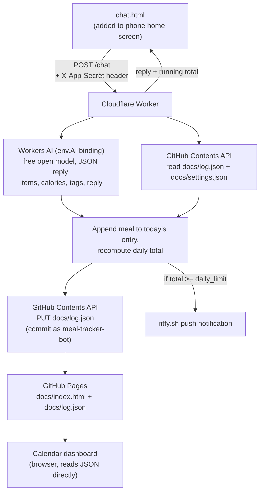

# Architecture

How this system is built and why. For setup and day-to-day changes, see
[INSTRUCTIONS.md](INSTRUCTIONS.md) instead.

## Design constraint: genuinely $0, mostly GitHub

Like the job-scraper project, the data store and dashboard are GitHub itself:
a git-committed JSON file is the database, and GitHub Pages (serving `docs/`)
is the read-only dashboard. The one addition here is a single Cloudflare
Worker, needed because — unlike the job-scraper's scheduled cron job — this
app has to respond to you in real time when you log a meal. GitHub Actions
has no "respond to an HTTP request in under a second" mode; Cloudflare
Workers' free tier (100k requests/day, no card required) does.

Calorie parsing runs on **Cloudflare Workers AI** (an open-source model, bound
directly into the Worker), not the Anthropic API — Anthropic has no free API
tier, and per-request billing would violate the "$0" requirement. Workers AI's
free daily allowance requires no card and, on Cloudflare's free Workers plan,
requests past that allowance simply fail rather than billing you — there's no
way to accidentally incur a charge. The trade-off is estimate quality: an open
8B model's calorie guesses are a real notch below Claude's, closer to "rough
ballpark" than "look this up carefully." See "Calorie estimation" below for
the actual prompt.

The Worker is the only thing that ever holds secrets (a GitHub token, your
ntfy topic, your app password). Nothing secret ever touches `docs/`, because
anything in `docs/` is public — view-source on the GitHub Pages site shows
everyone the code, same as job-scraper's dashboard.

## End-to-end flow



`index.html` (the calendar) and `chat.html` (the logging UI) both read
`log.json`/`settings.json` directly as static files — no Worker call needed
just to display data. The Worker is only invoked to *write* (`/chat`,
`/settings`).

## Repo layout

```
meal-tracker/
  docs/                    # GitHub Pages root — the only publicly served folder
    index.html             # calendar dashboard
    chat.html              # meal-logging chat UI (this is what you pin to your home screen)
    manifest.json           # lets chat.html be "installed" as a standalone app
    icon.svg
    log.json                # the meal log — written by the Worker, read by both pages
    settings.json            # { daily_limit } — written by the Worker's /settings endpoint
  worker/
    worker.js                # Cloudflare Worker source — paste into the dashboard's code editor
  ARCHITECTURE.md            # this file
  INSTRUCTIONS.md            # setup + day-to-day operations
```

There's no `data/` vs `docs/` split like job-scraper has — job-scraper keeps
a full permanent archive (`data/seen_jobs.json`) separate from a filtered
live view (`docs/jobs.json`) because those have different lifecycles
(archive never shrinks, live view expires closed jobs). Here, the log *is*
the display; there's nothing to filter out, so one file serves both purposes.

## Why the Worker needs `APP_SECRET`

CORS (`Access-Control-Allow-Origin`) only stops *browsers* from letting other
websites' JavaScript call your Worker — it does nothing against someone
calling the Worker URL directly (curl, a script, etc.), and the URL itself is
sitting in plain view in `chat.html`'s source once the repo is public. Without
a check, anyone who found that URL could rack up charges against your
Anthropic key or write garbage into your log. `APP_SECRET` is a password only
you know; the front end asks for it once, stores it in `localStorage`, and
sends it as `X-App-Secret` on every write. This is not bulletproof (anyone who
gets your phone unlocked and opens dev tools could read it out of
localStorage) but it stops the realistic threat, which is a stranger finding
the public URL.

## Data model

`docs/log.json`:

```json
{
  "2026-08-28": {
    "meals": [
      {
        "time": "2026-08-28T08:15:00.000Z",
        "raw_input": "2 eggs, 1 slice toast with butter, tags: breakfast vegetarian",
        "items": [
          { "name": "egg", "quantity": "2", "calories": 140 },
          { "name": "toast with butter", "quantity": "1 slice", "calories": 120 }
        ],
        "tags": ["breakfast", "vegetarian"],
        "total_calories": 260
      }
    ],
    "total_calories": 260
  }
}
```

`docs/settings.json`: `{ "daily_limit": 2000 }`.

## Calorie estimation

The Worker calls Workers AI (`@cf/meta/llama-3.1-8b-instruct` by default,
swap the `AI_MODEL` constant in `worker.js` if it's ever retired) with a
system prompt instructing it to respond with only a JSON object matching a
fixed shape (item list, calories, tags, a short reply). Unlike Anthropic's
forced tool-use, Workers AI's chat models aren't guaranteed to obey a JSON-only
instruction perfectly — `callWorkersAI()` regex-extracts the first
`{...}` block from the response and throws a friendly "try rephrasing" error
if that fails or required fields are missing, rather than silently logging
garbage. Estimates come from the model's general nutrition knowledge, not a
food database — treat them as rough ballpark figures, not lab-grade
precision, more so than a Claude-based version would be.

## Known limitations (MVP)

- **Timezone**: `chat.html` sends the browser's local date so meals land on
  the day you actually ate them regardless of the Worker's server timezone.
  Logging right at midnight is the one edge case that could land on either
  day depending on exact timing.
- **No edit/delete UI yet**: fixing a mis-logged meal means editing
  `docs/log.json` directly on GitHub (or asking Claude to do it) and
  committing the change — same manual-edit pattern as job-scraper's
  `config.yaml`.
- **Samsung calendar sync**: deliberately deferred. The planned path is
  generating an `.ics` feed from `log.json` and hosting it in `docs/`, then
  subscribing to it in Google Calendar ("Add calendar > From URL") — Samsung
  Calendar syncs Google calendars automatically, so no native Android code
  should be needed. Not built yet.
- **One Worker, one user**: there's no multi-user auth beyond the single
  shared `APP_SECRET` — fine for a personal app, not something to extend to
  multiple people without real auth.
